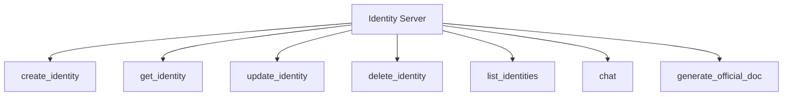

<!--
 * @Date: 2025-05-12 13:40:31
 * @LastEditors: CZH
 * @LastEditTime: 2025-05-12 13:42:24
 * @FilePath: /identity-mcp-server/README.md
-->
# 🔑 Identity MCP Server

[](https://github.com/czhmisaka/MCP_commonTool.git)
[]()
[]()
[](https://github.com/czhmisaka/MCP_commonTool/actions)
[](https://libraries.io/github/czhmisaka/MCP_commonTool)

> 一个基于MCP协议的身份管理服务器，提供身份创建、管理和交互功能


## ✨ 功能特性

| 功能         | 描述                                        |
| ------------ | ------------------------------------------- |
| 🔄 身份管理   | 完整的身份生命周期管理(创建/读取/更新/删除) |
| 💬 智能交互   | 与身份助手进行自然语言聊天                  |
| 📄 文档生成   | 生成正式文档(支持红头文件等格式)            |
| ⚙️ 标准化接口 | 基于MCP协议的RESTful API                    |

## 快速开始

```bash
# 克隆仓库
git clone https://github.com/czhmisaka/MCP_commonTool.git
cd MCP_commonTool

# 安装依赖
nvm use
npm install

# 开发模式
npm run dev

# 生产构建
npm run build
npm start
```

## 📚 API文档



| 工具                    | 描述           | 示例                                                 |
| ----------------------- | -------------- | ---------------------------------------------------- |
| `create_identity`       | 创建新身份     | `{name: "AI助手", traits: {role: "assistant"}}`      |
| `get_identity`          | 获取身份详情   | `{id: "123"}`                                        |
| `update_identity`       | 更新身份信息   | `{id: "123", name: "新版AI"}`                        |
| `delete_identity`       | 删除身份       | `{id: "123"}`                                        |
| `list_identities`       | 列出所有身份   | `{}`                                                 |
| `chat`                  | 与身份助手聊天 | `{identityId: "123", messages: [...]}`               |
| `generate_official_doc` | 生成正式文档   | `{elements: [{type: "红头文件标头", word: "通知"}]}` |

> 详细输入模式请参考源代码中的类型定义

## 贡献

1. Fork本仓库
2. 创建特性分支 (`git checkout -b feature/your-feature`)
3. 提交更改 (`git commit -am 'Add some feature'`)
4. 推送到分支 (`git push origin feature/your-feature`)
5. 创建Pull Request

请确保通过所有测试并遵循代码风格。

## 许可证

MIT
